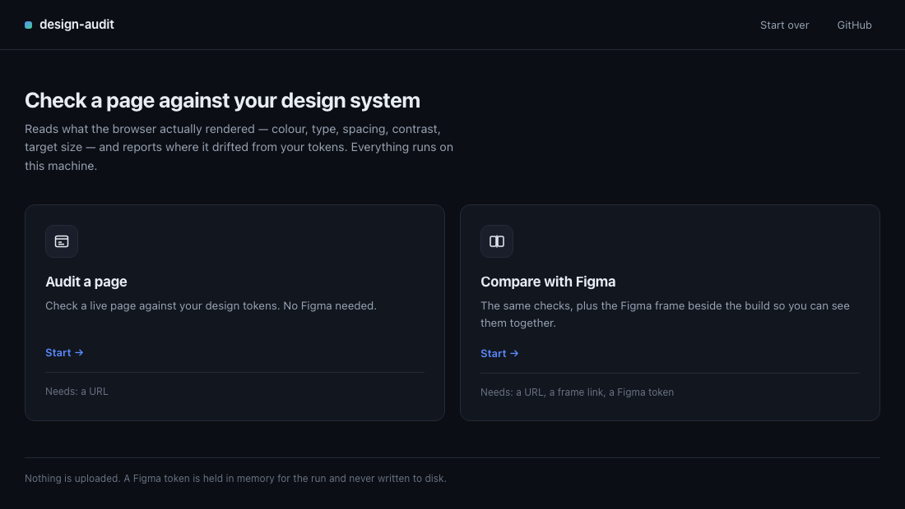
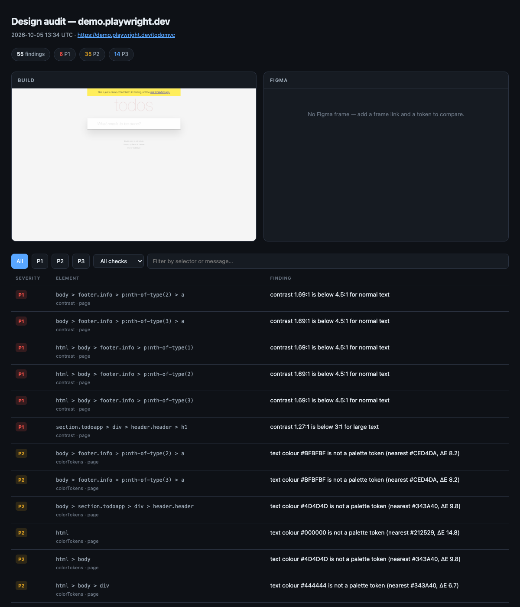
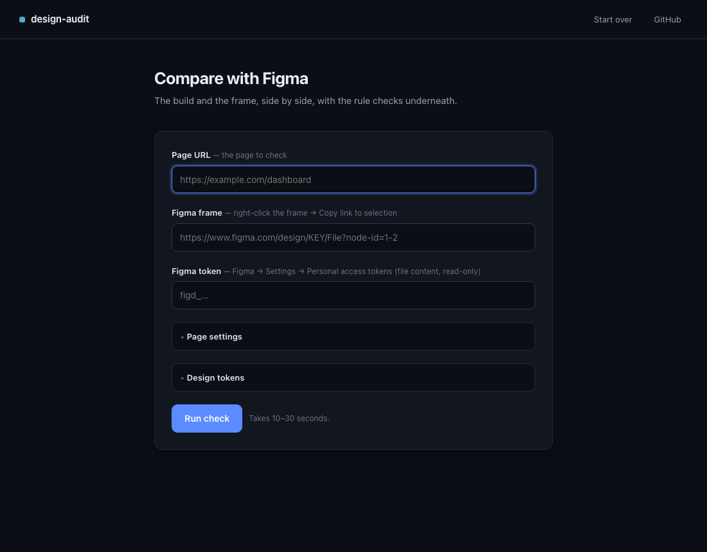
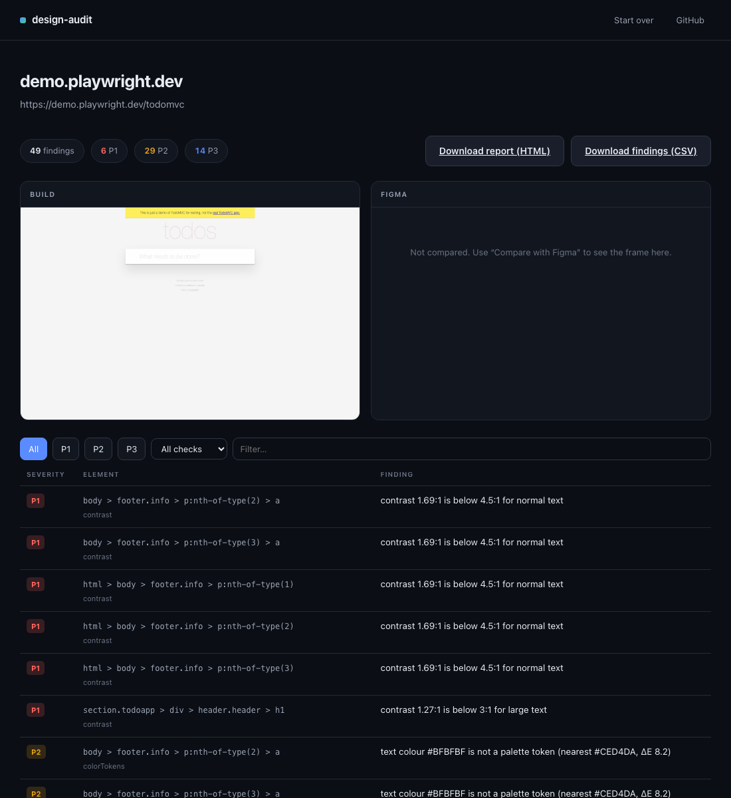
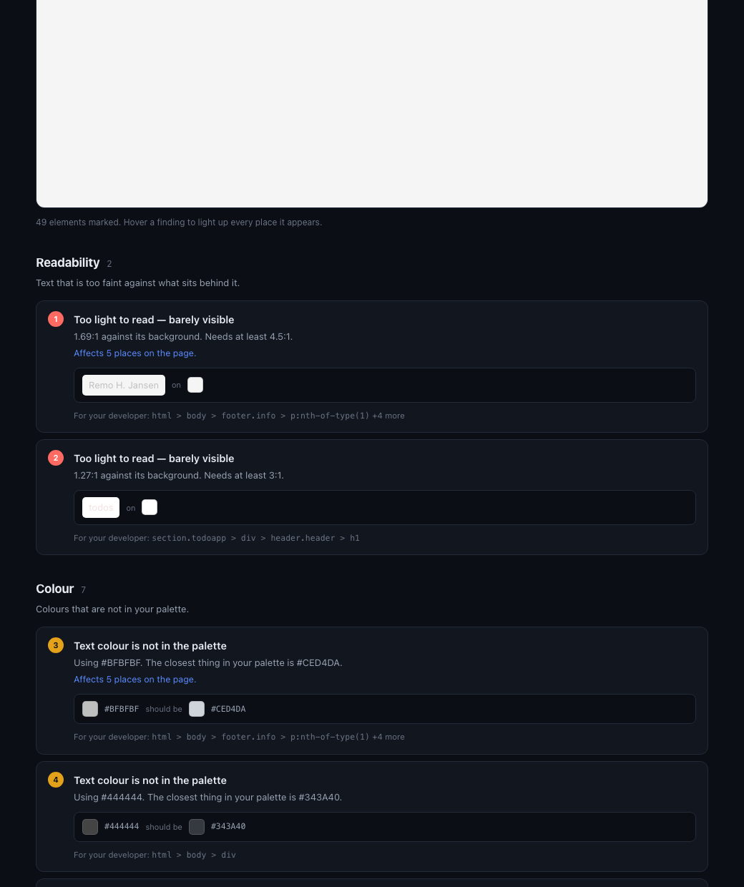
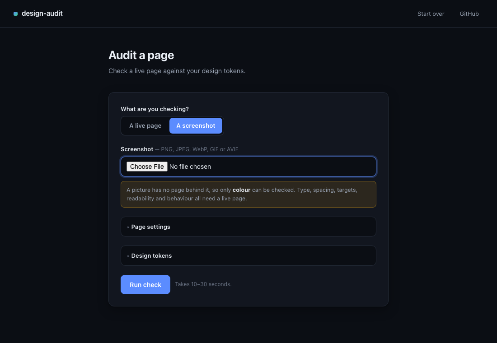

# design-audit

Compare a running web UI against its Figma source of truth, and report where they diverge.

Design systems drift. A colour gets hardcoded, a font size lands between two steps on the scale, a button ends up 18px tall. Nobody decided any of it — it accumulated. This tool finds that drift automatically, and keeps a record of the divergences somebody *did* decide on, so they stop coming back as new findings.

It is not tied to any particular product. Point it at a URL, give it your tokens, and it works.

**Two ways to use it.** Paste a URL into a local page and press a button, or wire the CLI into CI.

**Two things to check.** A live page, or a screenshot — a mockup, an export, an image somebody sent you.

```bash
node src/cli.mjs serve      # → http://127.0.0.1:4000
```



Two modes. **Audit a page** checks a live page against your tokens. **Compare with Figma** does the same and puts the frame beside the build.

---

## What it does

**Capture** — drives the page with Playwright: loads it, runs any scripted interactions (log in, open a menu, select a row), takes a **full-page** screenshot, and reads the computed styles of every visible element. Coordinates are document-absolute, so a finding 4,000px down still gets marked where it actually is.

**Clear the way** — almost every real site opens behind a cookie dialog. Left alone it dims the page, so the screenshot is useless, and its own markup gets audited. It is dismissed before anything is measured, then the page is given time to settle, because dismissing often starts rendering that was blocked behind it.

**Declining is the default.** Accepting on someone's behalf sets tracking cookies they did not ask for, and either answer clears the dialog equally well. Nine common consent platforms are recognised by selector, anything else by button text in six languages. You can override with your own selector, or turn it off.

**Follow** — optionally walks one hop out from the starting page and audits what it finds. Same origin only, never links that look like they change state (logout, delete, checkout), never non-pages, and never more than you ask for.

**Fetch** — pulls the matching frame from Figma via the REST API, so the intended design sits next to the built one.

**Fold** — in two stages, because two different things get repeated.

*Byte-identical* findings — same check, same element, same message — become one with a count. A console warning logged 34 times by one script is one thing to fix, and listing it 34 times discredits the whole report. Design findings are never byte-identical, since each carries a different selector, so this only ever folds genuine repeats.

*Equivalent* findings — same problem on different elements — become one problem in the designer review that lists everywhere it appears. The developer report and the CSV keep them separate, because each element still needs changing.

**Check** — two sets of rules, one per audience.

*Design* — how it looks, read from the computed styles:

| Check | What it catches |
|---|---|
| `colorTokens` | Rendered colours that aren't in the palette, measured by perceptual distance (CIE76 ΔE) rather than string equality — so `#0D6EFE` is correctly reported as *nearly* `#0D6EFD`, not as a different colour entirely |
| `typeScale` | Font sizes off the scale, families outside the system, weights that don't exist in it |
| `spacingGrid` | Padding and margin that aren't multiples of the base unit |
| `contrast` | Text below WCAG AA, measured against the background the text **actually renders on** — resolved by walking up the DOM through transparent ancestors, and compositing translucent colours before measuring |
| `targetSize` | Interactive controls below the minimum target size (WCAG 2.2 SC 2.5.8) |
| `crossScreen` | The same component styled differently on different pages — the one thing no single-page check can see |
| `visualDiff` | Where the build capture and the Figma frame actually differ, compared perceptually in blocks |

*Runtime* — whether it works, read from the page as it actually ran:

| Check | What it catches |
|---|---|
| `errors` | Uncaught exceptions, console errors and warnings, failed requests, 4xx and 5xx responses |
| `interactions` | Controls that were driven and did not respond — or did not work at all |
| `pageLoad` | Load time and time to first byte against your thresholds |
| `mainThread` | Long tasks that blocked the main thread, and layout shift |
| `brokenControls` | Links that go nowhere, buttons with no accessible name, images that failed to load, fields with no label |

**Report** — a designer review and a developer report as self-contained HTML, a findings CSV for triage, and Markdown plus JSON for CI. Exits non-zero on a P1 so it can gate a pipeline.

---

## Keeping a record

A single audit tells you where you are. A series tells you whether you are getting better.

```bash
node src/cli.mjs run --config design-audit.config.json      # recorded
node src/cli.mjs run --config design-audit.config.json --draft   # not recorded
node src/cli.mjs history --config design-audit.config.json
```

```
  Date              Findings   P1   P2   P3   Pages
  ----------------------------------------------------
  2026-10-06 13:00      1395   11 1186  198       2
```

Each run reports what moved since the last one — `0 findings · 1 fixed · 1 new` — matched by a fingerprint of the finding, so a fix and a regression are told apart rather than netted off.

**Drafts stay out of it.** Work in progress should be auditable without polluting the record; an exploratory run that drags the trend down teaches the team to stop running audits.

## Decisions

An exception records a decision that silences a finding. Plenty of decisions do not:

```bash
node src/cli.mjs decide --config design-audit.config.json \
  --finding "crossScreen|nav > a.navbar__link|text colour differs between screens" \
  --ruling by-design --by "Design lead" \
  --why "The active nav item is meant to be highlighted."
```

Rulings are `build-must-change`, `design-must-change`, `by-design`, `wont-fix` or `deferred`. Every one lands in `decisions.md` with who decided and why — a decision that is not written down gets made again. A `by-design` ruling also becomes an exception, so it stops being reported.

## The part that matters: exceptions

Most audit tools have the same failure mode. They report the same twelve things every run, somebody decides that four of them are fine, and next week they're reported again. Eventually everybody stops reading the report.

So approved divergences live in a file, and the runner enforces them:

```json
{
  "id": "EX-001",
  "check": "colorTokens",
  "match": { "screen": "checkout", "value": "#4A90D9" },
  "reason": "Third-party payment widget ships its own focus ring. Vendor won't expose it.",
  "approvedBy": "Design lead",
  "approvedOn": "2026-01-15",
  "expiresOn": "2026-12-31"
}
```

Three rules make this work rather than become a dumping ground:

- **An exception without a `reason` and an `approvedBy` is rejected.** One with neither is indistinguishable from a bug somebody got tired of seeing.
- **An empty `match` is rejected**, because it would silently suppress every finding from that check.
- **Expired exceptions stop suppressing** and are listed in the report so they get revisited. Unused ones are listed too — either the bug was fixed and the exception can go, or the match block has drifted and is no longer catching anything.

Suppressed findings still appear in the report, under *By design*, with their reason and approver. The decision stays visible; it just stops being noise.

---

## Example output

Every run writes `report.html` — one self-contained file with the build capture and the Figma frame side by side, filterable findings, and click-to-copy selectors. Images are embedded, so you can send the file to someone on its own.



There is also `report.md` and `report.json` for CI. Run against the public [TodoMVC demo](https://demo.playwright.dev/todomvc) with the example tokens — 15 elements, 49 findings:

```
**49 findings** — 6 P1, 29 P2, 14 P3

## contrast — 6

| Severity | Screen | Element | Finding |
|---|---|---|---|
| P1 | todomvc | `body > footer.info > p:nth-of-type(2) > a`    | contrast 1.69:1 is below 4.5:1 for normal text |
| P1 | todomvc | `section.todoapp > div > header.header > h1`   | contrast 1.27:1 is below 3:1 for large text    |

## colorTokens — 11

| Severity | Screen | Element | Finding |
|---|---|---|---|
| P2 | todomvc | `section.todoapp > div > header.header > input.new-todo` | text colour #4D4D4D is not a palette token (nearest #343A40, ΔE 9.8) |
```

Selectors carry `:nth-of-type` where siblings share a tag, so each row points at one element you can paste into devtools.

## Install

```bash
git clone https://github.com/Lubnabano02/design-audit.git
cd design-audit
npm install
npx playwright install chromium
```

Node 18+. `npm install` brings in Playwright; the second line downloads the browser it drives (~150 MB, once).

If you only want the rule checks and not the page capture, `npm install` alone is enough — `npm run demo` and `design-audit check` work without a browser.

## Try it without setting anything up

```bash
npm run demo
```

Runs the checks against a bundled fixture with deliberately planted problems, and prints the report. No browser, no Figma account, no config.

## Use it without the command line

```bash
node src/cli.mjs serve
```

Leave that terminal open and go to **http://127.0.0.1:4000**. Ctrl+C stops it.



Results arrive as a page you can filter, with both reports one click away:



**Three downloads per run — two audiences, not two file types:**

| File | Who it's for |
|---|---|
| `designer-review-<site>.html` | **The designer.** Design concerns only — runtime problems belong in the developer report. One card per *problem*, not per element — nine elements using the wrong font is one decision, not nine. Grouped by concern, in plain language, with colours shown as swatches, type sizes rendered, and failing text displayed in the colours that are failing. Hover a finding to light up every place it appears. Selectors are tucked into a "for your developer" line. |
| `developer-report-<site>.html` | **The developer.** Selectors, properties, measured against expected, filterable, with the Figma frame beside the build. |
| `findings-<site>.csv` | **Triage.** One row per finding with severity, check, element, property, value and expected. Opens in Excel or Sheets for assigning work. Suppressed findings carry their reason, so a decision stays visible. |



It binds to localhost only and holds the Figma token in memory for the length of the run — never written to disk. That is the reason this runs on your machine instead of being hosted somewhere.

## Checking a screenshot

Audit mode takes either a URL or an image. A picture has no page behind it, so **only colour can be checked** — type, spacing, targets, readability and behaviour all need a running page. The report says so at the top rather than quietly returning a thinner audit.



What it does do is let you hold a mockup to the same palette as the build, which the URL mode cannot. Colours are extracted in a canvas with smoothing off, bucketed, and matched against your palette by perceptual distance.

## Use it on your own project

**1. Describe your design system** as the rules the build is checked against — `tokens.json`:

```json
{
  "color":   { "palette": ["#FFFFFF", "#212529", "#0D6EFD"], "toleranceDeltaE": 3 },
  "type":    { "families": ["Inter"], "sizesPx": [12, 14, 16, 20, 24, 32], "weights": [400, 500, 600, 700] },
  "spacing": { "basePx": 4 },
  "contrast":   { "minNormalText": 4.5, "minLargeText": 3.0 },
  "targetSize": { "minPx": 24 },
  "performance": {
    "pageLoadWarnMs": 2500, "pageLoadFailMs": 5000, "ttfbWarnMs": 600,
    "longTaskMs": 50, "longTaskBudgetMs": 400,
    "interactionWarnMs": 300, "interactionFailMs": 1000, "layoutShiftWarn": 0.1
  }
}
```

**2. Describe your screens** — `design-audit.config.json`:

```json
{
  "baseUrl": "https://your-app.example.com",
  "tokensFile": "./tokens.json",
  "exceptionsFile": "./exceptions.json",
  "figma": { "fileKey": "env:FIGMA_FILE_KEY", "token": "env:FIGMA_TOKEN" },
  "viewport": { "width": 1440, "height": 900 },
  "screens": [
    {
      "name": "dashboard",
      "path": "/dashboard",
      "figmaNodeId": "1:2",
      "waitFor": "text=Overview",
      "interactions": [
        { "name": "open-filters", "action": "click", "selector": "button[aria-label='Filters']", "expect": "text=Date range" }
      ]
    }
  ]
}
```

`figmaNodeId` accepts a bare id (`1:2`) or a pasted Figma URL.

**3. Run it:**

```bash
export FIGMA_TOKEN=figd_...
export FIGMA_FILE_KEY=...
node src/cli.mjs run --config design-audit.config.json
```

Writes `audit-runs/<date>/<screen>/build.png`, `figma.png`, `snapshot.json`, and `review.html`, `report.html`, `report.md`, `report.json` at the run root.

---

## Running it in CI

`check` exits `1` if any P1 survives its exceptions, so it drops into a pipeline unchanged:

```yaml
- run: npx playwright install --with-deps chromium
- run: node src/cli.mjs run --config design-audit.config.json
  env:
    FIGMA_TOKEN: ${{ secrets.FIGMA_TOKEN }}
    FIGMA_FILE_KEY: ${{ secrets.FIGMA_FILE_KEY }}
```

Start with contrast as the only P1. Promoting more checks to P1 before the backlog is clear just teaches everyone to pass `--no-verify`.

---

## What this does not do yet

Being honest about the edges, because a tool that overstates itself wastes your afternoon:

- **Visual diff is a pointer, not a verdict.** It compares the build and the frame in 16px blocks by perceptual distance, which keeps anti-aliasing and font hinting out of the results — but a frame and a live page legitimately differ in content, so treat the boxes as "look here", never "this is wrong".
- **Cross-screen compares styling, not layout.** Comparing height was tried and dropped: it reported content regions that are supposed to differ and text that wrapped onto two lines, 28 noise findings hiding 2 real ones. Without a curated list of which elements are chrome, height cannot be told from content.
- **No Jira or Google Sheets push.** Deliberate. Those are organisation-specific plumbing, and wiring them in would make a general tool worse. The JSON and CSV outputs are there to be piped wherever you need.
- **The Figma download path has not been run against the live API.** Everything else has: the capture, the checks, the HTML report and the local UI were all run end to end against a public site, and the screenshots above are that real output. The Figma half is written and unit-tested for URL parsing, but nobody has yet pointed it at a real file with a real token. Expect to hit something the first time.
- **Results live in memory.** Downloads stay available while the server is up; stopping it clears them.
- **No Figma-side token extraction.** Tokens are declared by hand in `tokens.json` rather than read from Figma variables. Reading them from the file via the Variables API is the obvious next step.
- **Captures one state per page.** Interactions run in sequence and the shot is taken at the end (or at `captureAfter`). Several states per page would need them described as separate entries.
- **Link-following goes one hop.** It reads links on the page you give it; it does not walk the whole site, read sitemaps, or go deeper.
- **A consent dialog it cannot find stays put.** If something still covers more than 40% of the page after dismissal, the run says so rather than pretending the capture is clean.
- **Not tested against every auth setup.** `storageState` covers the common case of a saved logged-in session. SSO flows that re-challenge will need their own handling.
- **Static analysis only.** It reads what rendered. It will not catch a layout that breaks at a viewport you didn't list.

## Tests

```bash
npm test
```

Ten tests covering the colour maths against published WCAG reference values, each check firing on a known-bad fixture, and the exceptions logic — including that expired exceptions stop suppressing and that an under-specified exception is rejected.

---

## Security

Everything that identifies a specific project stays out of the repo. `.gitignore` excludes `design-audit.config.json`, `tokens.json`, `exceptions.json`, `.auth/`, `.env` and `audit-runs/` — only the `.example.json` files are committed. Figma credentials are read from the environment and never from config.

If you fork this for internal use, keep it that way: a config file is a map of your private routes, selectors and file keys.

## Licence

MIT
